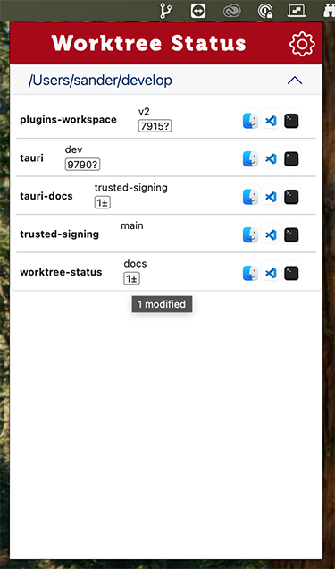
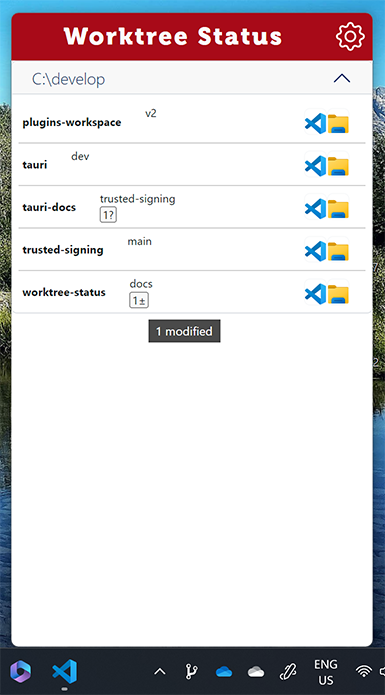

# Worktree Status

Application to help with overview of state of multiple working copies / state of git repositories.

You open a folder containing git repositories and/or worktrees. The tool checks the local state and branch names every
time the window opens. Next to the branch status there are quick actions you can setup to quickly open things like VS Code
or an explorer / Finder view on the folder.

Screenshots:

macOS | Windows
:-------------------------:|:-------------------------:
 | 

## How to get it

Available on macOS and Windows, see [releases page](releases/)

After launcing the application starts and is shown in the menu bar / notification area as a icon 

## Contributing, open issues or PRs

If you have ideas request feel free to open issues or contribute with your PR.

### Recommended IDE Setup

- [VS Code](https://code.visualstudio.com/) + [Tauri](https://marketplace.visualstudio.com/items?itemName=tauri-apps.tauri-vscode) + [rust-analyzer](https://marketplace.visualstudio.com/items?itemName=rust-lang.rust-analyzer)
